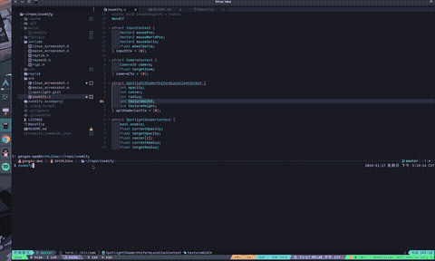
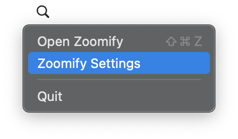

# Zoomify, yet another zoomer application



Yet another zoomer application on Linux(X11) & macOS implemented in [raylib](https://github.com/raysan5/raylib)
with some personal needs that inspired by [Boomer](https://github.com/tsoding/boomer).

## Dependencies

### Linux

#### Ubuntu

```sh
sudo apt install libasound2-dev libx11-dev libxrandr-dev libxi-dev \
libgl1-mesa-dev libglu1-mesa-dev libxcursor-dev libxinerama-dev libwayland-dev libxkbcommon-dev
```

#### Fedora

```sh
sudo dnf install alsa-lib-devel mesa-libGL-devel libX11-devel libXrandr-devel \
libXi-devel libXcursor-devel libXinerama-devel libatomic
```

#### Arch Linux

```sh
sudo pacman -S alsa-lib mesa libx11 libxrandr libxi libxcursor libxinerama
```

### macOS

macOS 14.0+, Xcode, Xcode Command Line Tool

## How to use

### Linux & macOS

```sh
make install
zoomify
```

For Linux, this will build zoomify and cp the executable file to `/usr/local/bin/`.
If you don't wanna do that, you can just run `make BUILD_MODE=RELEASE`, and the executable
file will be located at `build/zoomify`.

For macOS, this will build zoomify and zoomifyd, and cp `zoomifyd.app` to `/Applications`.
Zoomifyd is a menu bar app which provides the ability to bind a shortcut to open
zoomify globally. If you don't wanna install that, you can just run
`make BUILD_MODE=RELEASE`, the zoomify will be located at `build/Release/zoomify`
and the `zoomifyd.app` will be located at
`build/Release/zoomifyd.xcarchive/Products/Applications/zoomifyd.app`.



### Windows

Not implement yet.

## Keybinds

| key                           | description                              |
| :---------------------------- | :--------------------------------------- |
| Drag with left mouse button   | Move screenshot around                   |
| Scroll mouse wheel            | Zoom in & out or change spotlight radius |
| <kbd>l</kbd>                  | Toggle spotlight                         |
| <kbd>h</kbd>                  | toggle keystroke tips                    |
| <kbd>ESC</kbd>                | Quit Zoomify                             |

## TODO

- [x] Basic functionality (zoom in & out, toggle spotlight)
- [ ] Options by command line parameters
- [x] Multiscreen support
- [ ] Draw on canvas
- [ ] Save the selected screenshot as an image
- [ ] Wayland support
- [ ] Windows support

## License

MIT License

## References

[Boomer](https://github.com/tsoding/boomer)
